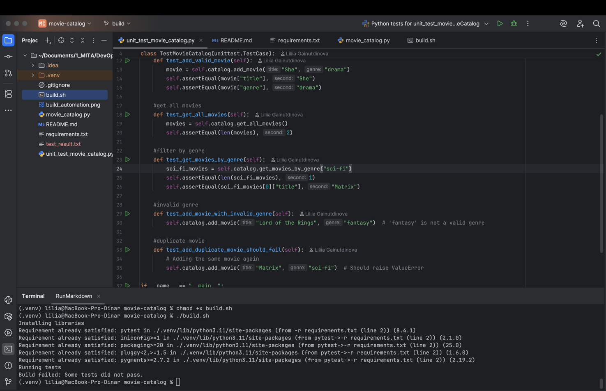

# movie-catalog

This is a simple movie catalog application developed in Python.

### Features:
1. Add movie to catalog
2. Get all movies in catalog
3. Get movies by genre

### Unit Testing
Project has 5 unit-tests, three of them are passed, two are failed.
As a result the build will not be successful due to the failed tests.

Dependencies listed in `requirements.txt`. To install them, run:
```bash
pip install -r requirements.txt
```

### How to run the build

To build the application and run the tests automatically, use the `build.sh` script:

```bash
./build.sh
```
If you get a "permission denied" error when running build.sh, use this command to grant execute permissions:
```bash
chmod +x build.sh
```

This script installs dependencies and executes all unit tests.

### Build Automation Result
